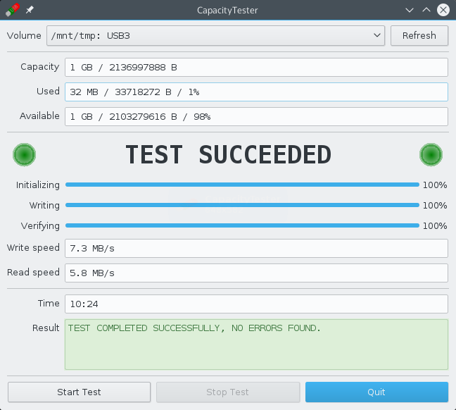
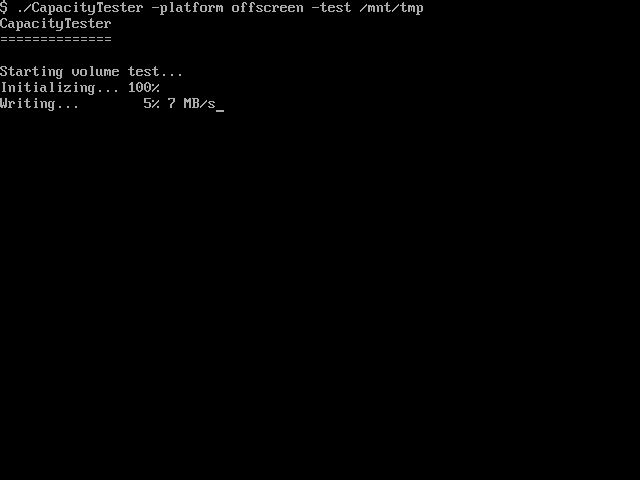
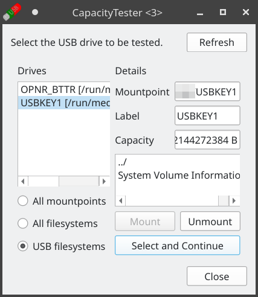

CapacityTester
==============

- Test your new USB flash drive from China to find out if its full capacity can be used or if it's fake!
- The *volume test* fills the filesystem, verifying that all of it can be used. It's slow, it takes hours.
- The *disk test* overwrites the drive itself and is much faster (some GB/TB large USB drives can be checked in less than 10 minutes); but it's somewhat experimental.
- To learn more, keep reading. To start using CapacityTester now, download and try [CapacityTester for Linux](https://github.com/c0xc/CapacityTester/releases/download/v0.5/Capacity_Tester-x86_64.AppImage) (or [Windows](https://github.com/c0xc/CapacityTester/releases/download/v0.5/capacity-tester.exe)) now.

**New feature: Destructive Disk Test - test your flash drive within minutes** ([feedback](https://github.com/c0xc/CapacityTester/issues/12) appreciated)

---

Have you bought a 128 GB USB flash drive (pen drive, usb stick) for $10/€10,
with "free" shipping from Asia?
If you ask something, you get a response in broken English from a Chinese guy
who's calling himself "Jennifer"...
Thinking about taxes and shipping fees, you're beginning to wonder how cheap
this particular drive is compared to one in a local shop?
Let's face it: You've probably bought a **fake flash drive**, i.e.,
one that actually has much less capacity than it claims to have.

This tool can test a USB drive or memory card to find out if it's a fake.
For example, a fake might be sold as "64 GB USB thumb drive"
but it would only have a real capacity of 4 GB, everything beyond this limit
will be lost. At that point, the fake flash drive is often rendered useless.

This tool performs a simple test to determine if the full capacity
is usable or not. All it does is fill the volume with test data (files)
and verify if the data on the volume is correct.

The drive selection window lists all USB storage devices.
This is a Linux feature. If unavailable, all mounted filesystems are listed.

Tip: You can run this program from a Linux live system like the Fedora installer disc.

Download
--------

**Linux Desktop**:  
There are pre-compiled executable files available for Linux
which can be downloaded from the "[Releases](https://github.com/c0xc/CapacityTester/releases)" page.  
Direct [download for Linux](https://github.com/c0xc/CapacityTester/releases/download/v0.5/Capacity_Tester-x86_64.AppImage).

From the latest release there, under "assets", you'll find them.

**Windows**:  
There is a Windows version available, but it's slightly experimental,
the format feature is missing. See release [v0.5](https://github.com/c0xc/CapacityTester/releases/tag/v0.5).  
Direct [download for Windows](https://github.com/c0xc/CapacityTester/releases/download/v0.5/capacity-tester.exe).
The [zip archive](https://github.com/c0xc/CapacityTester/releases/download/v0.5/CapacityTester_Win7.zip) contains a couple of files, all of which should be extracted
into the same directory which is only used by CapacityTester.

If the executable file does not run because you don't have some libraries
installed, pick the AppImage file which is supposed to be portable.
The AppImage file should run on most modern Linux systems
out of the box.
If you're experiencing issues running this program on Linux,
you may open an [issue](https://github.com/c0xc/CapacityTester/issues).

Volume Test
-----------

The volume test fills a filesystem (volume refers to a mounted filesystem)
and then verifies the data. It may even detect a fake drive before
it's 100% full (so-called pre-check), but that's not guaranteed.
To select the USB volume to be tested, use the selection dialog.
From there, you can mount it if it's not mounted already.

Although the test is non-destructive (i.e., it won't touch existing files),
you should make sure to remove any existing files from the drive.
The volume must be completely empty (no files on it)
for the test to provide reliable results.
If you select a drive which is not empty, you'll be warned that it should
be empty together with a list of files found.

During the initialization phase of the test,
temporary test files are created.
After the initialization phase, a test pattern is written to the drive,
which is then read back and verified.
During the test, the drive will be completely filled up.
If you have a fake drive, the test would fail when test data
written beyond the real capacity limit is read back.
The test should also fail if a genuine drive has become defective.

After the test has finished, the temporary files are deleted automatically.
However, if the drive is removed or dies during the test,
the files will have to be deleted manually by the user.
*Note that after you've written beyond the real capacity limit of a fake drive,
the drive's filesystem is often damaged, causing a subsequent test to fail
much earlier. To start over, you should reformat the drive (see advanced).*

The program does not detect and report the type of fake,
it just reports an error and where the error has occurred.
This may or may not provide an estimate on the real capacity of the drive,
but no guarantees are made regarding the accuracy of the result.

A volume test works with files on top of the filesystem of the drive,
so it does not know where each file ends up on the drive.
It depends on the filesystem where each test file is written
and how it may be fragmented.
This means that the reported offset in case of an error is a file offset,
not a physical offset and it might be much smaller than the real capacity
of a fake drive.
So if you've formatted your drive using a common filesystem like ext or btrfs,
you can almost be sure that the logical file offset is unrelated
to the physical offset. For a volume test, you should format the drive
with the exfat filesystem (alternative: fat32/vfat).

Many complex filesystems do not allow the full capacity to be used
as metadata and fragmentation can reduce the available capacity
once files are written.
For that reason, there is a buffer, which should be around 1 MB.
Some filesystems such as FAT32 do not need that buffer (SAFETY_BUFFER = 0).

Destructive disk test
---------------------

Some fake flash drives are extremely slow due to their size
and the fact that they are not USB 3.0 devices (even though some
have fake blue-painted USB2 connectors).
A volume test on a huge fake drive could take days in some extreme cases.
For these cases, there's the *destructive disk test*.
It works with the whole USB flash drive, so if it contains a partition,
that partition must be unmounted. It's destructive as it overwrites
the drive, wiping its partition(s). When done, you need to reformat the drive,
see the format item under the advanced menu (Linux only).

The disk test is much faster than the volume test.
On a good day, you can run this test on a 1TB fake drive and be done in minutes
whereas the volume test would take hours or even days to finish.

However, the disk test is still somewhat experimental.
If you have a fake drive that's not properly detected, please open an issue
or send an email to the author (see below).
Other feedback is appreciated as well.

Build
-----

To start using CapacityTester now, it's recommended to
use the pre-built binary file available for download on the [releases](https://github.com/c0xc/CapacityTester/releases) page.

To build from source, use `qmake && make` (see [notes](BUILD_NOTES.md)).

If you want to help translating this program,
read the page on [how to translate](TRANSLATIONS.md) and/or open an issue.

Author
------

Philip Seeger (philip@c0xc.net)

License
-------

Please see the file called LICENSE.

