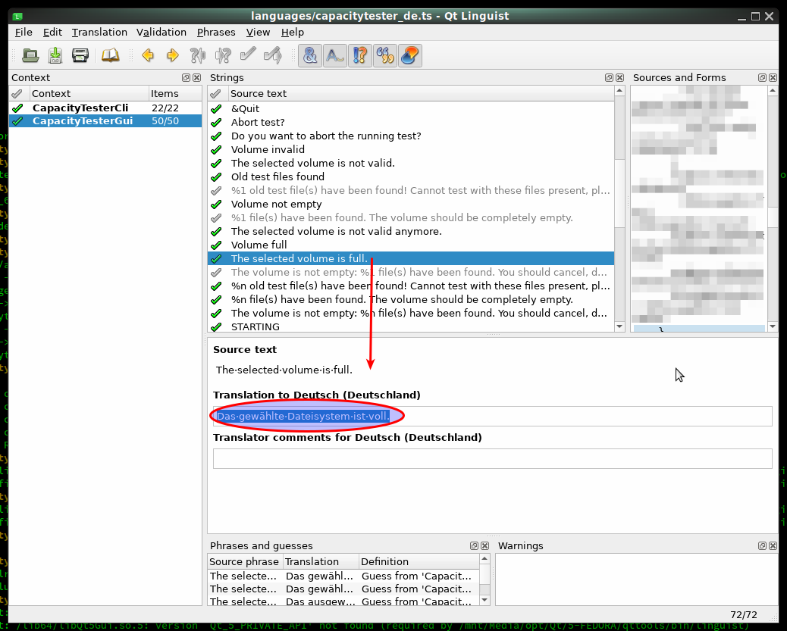
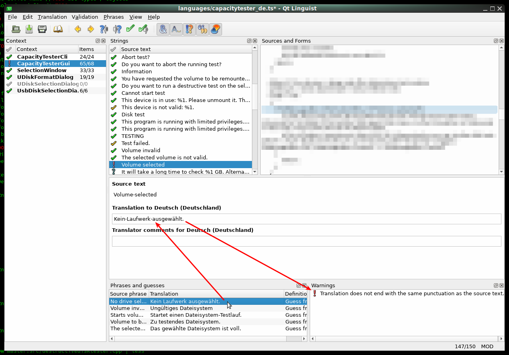

TRANSLATIONS
============

If you want to help translate this program into another language,
make a pull request with an updated ts file
or open an issue and ask.

The procedure is as follows.

For each language, there's a ts file in the `languages/` directory,
for example "capacitytester_en.ts" (English) or "capacitytester_es.ts" (Spanish).
This file contains all the texts that can be translated.
It can be opened and edited with the Qt Linguist program.

Even though all the untranslated texts are in English,
there is an English translation file to handle plural forms.
As shown in the following screenshot, the text "%n file(s) have been found"
requires two translations, one singular form "file has been found"
(where "%n" is 1) and one plural form "files have been found".
For languages with two different plural forms, three translations would
be required for this text.

This screenshot shows the file "capacitytester_de.ts"
for the German translation. If the text has no number in it,
simply type in the translated text and confirm to continue with the next one.

This screenshot shows how useful the hints are that Linguist shows.
For the selected source text, Linguist presents a number of suggestions
of similar translations that you previously entered, in the box, bottom left.
In this case, the first suggestion is very similar, so let's double-click it,
so it'll be copied into the translation text field,
then we just need to remove the first word to match the source text
(in this particular example).
The second type of hint, also shown in this screenshot, is much more
important. It shows a warning about a difference in grammar,
shown in the box (bottom right), in this case because our translation
(which is the suggestion that we've just copied) ends with a period
while the source text does not. So the source text is used as label,
where a period would look strange. So please be careful to always check
if there's a warning before confirming the translation,
before hitting Ctrl+Enter.

If you don't know how to translate something because the source text
appears unclear, like a technical term which has multiple meanings,
you may compare your draft with the German translation,
which is officially approved, and in doubt, open an issue (ticket).

When all text strings are translated (all having the green check mark),
save the file and send it in by opening a pull request.

Internals
---------

If the translation files are incomplete and the developer forgot
to update them, they can be updated using the `lupdate` tool:

    $ lupdate capacitytester.pro

Thanks
------

* Spanish translation by @caralu74 (issue #3)

